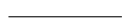

## Logistics

This is an individual assignment.
You are still able to get help from many sources as detailed in the [collaboration](collaboration) policy.

This assignment is worth 8 points total, 2 of which are checked on Gradescope automatically with an **autograder**, 2 of which are checked by the graders manually, and 4 for program style.

This assignment is due on Wednesday March 2nd at 10pm. See the [syllabus](syllabus) for the late policy.

## Goals
Get practice with recursion.

## Setup

Again, I recommend you complete this assignment in Olin 310, though it isn't required to do so.

[Mount the COURSES drive](https://wiki.carleton.edu/pages/viewpage.action?spaceKey=carl&title=CS+111+and+201+workflow+in+CS+labs) and remember to save everything into STUWORK. **If you don't do this, everything you write will disappear when you log out!!!!**
* Create a new folder in your STUWORK called `HW7`
* Open your `HW7` folder in VSCode

## recMaxFinder
In this problem set, you’ll get a chance to play with a visual example of recursion, but, first, one warm-up
exercise. 
In a file called `max.py`, write a *recursive* function `recMaxFinder` that takes a list of numbers as an argument and returns the **value of the maximum element** as follows:
* the maximum element in a list of length one is that one element.
* in a list of two or more numbers, the maximum element of the list is either the maximum element of the list containing all but the first element of the list (i.e., the maximum of `a_list[1:]`) or the first element of the list, depending on which is bigger. Note that you are **not allowed** to use the `max` or `min` functions.

For example:
```
$print(recMaxFinder([3, 4, 1, 10, 5]))
10
$print(recMaxFinder([3, 4, 1, 5]))
5
```

## Fractals

### Overview
A *fractal* is an image that is composed of smaller copies of itself. When drawing fractals, you typically specify a level, which tells you how “deep” to go in drawing smaller versions of the image. 
In this assignment, you’ll write a recursive function to generate the *von Koch snowflake*:


One way to think about a von Koch snowflake is as follows: 

Start with a triangle, for every line in the triangle (like the one on the left), replace it by a four-line piece (like the one on the right):

 

Then you repeat the exact same process on the resulting lines, and do it again, and again. The level of a fractal is the number of times that you repeat this “expansion” process.

### Your Task

Copy the `graphics.py` module into your folder.
In a file called `fractals.py`, first copy this starter code:
```
from graphics import *
def vonKochSegment(level,start,heading,length,window):
    if level == 0:
        end = Point(start.getX() + length * math.cos(math.radians(heading)), 
            start.getY() - length * math.sin(math.radians(heading)))
        line = Line(start, end)
        line.draw(window)
        return end
    else:
        # your code here

def vonKoch(length,level):
    window = GraphWin("von Koch Snowflake", length * 1.5, length * 1.5)
    p1 = Point(length / 4, length)
    p2 = vonKochSegment(level, p1, 0.0, length, window)
    # more of your code here
```

#### vonKochSegment
The function `vonKochSegment takes five arguments: a level (the
number of times that you do expansion), a starting point, a heading (in degrees counterclockwise from due east on the screen), a length of the line, and the graphics window in which to draw the resulting
image. 
The function should return the ending point of the segment. 

I've provided the base case when the level is 0.
In this situation, the program calculates the ending point of the segment (this requires some trigonometry: go length units in the direction of the heading, which means length * cos(heading)
in the x direction and -length * sin(heading) in the y direction), and then draws a line from the starting point to the ending point in window.
This generates one third of a von Koch snowflake of level 0.

You need to fill in the recursive case when the level is at least 1.
For the recursive case, you should draw four `level - 1` segments by making **four recursive calls** with the appropriate arguments:
* segment #1 starts at the starting point and goes `length / 3` units in direction `heading`.
* segment #2 starts where segment #1 ends and goes `length / 3` units in direction `heading - 60`.
* segment #3 starts where segment #2 ends and goes `length / 3` units in direction `heading + 60`.
* segment #4 starts where segment #3 ends and goes `length / 3` units in direction `heading`.

Remember to test your code at this point to be sure that it draws a segment correctly.
For example, the call `vonKoch(200, 3)` should result in an image like this:


#### vonKoch
Finally, you should expand the `vonKoch` function so that it draws three von Koch segments of level `level` arranged in an equilateral triangle. The first segment should head in direction 0, the second should head in direction 120 from the end of the first side, and the third should head in direction 240 from the end of the second side.

Include test code that draws von Koch snowflakes of levels 1, 2, 3, and 4 when `fractals.py` is run and doesn't close the window until the user hits "Enter" (this is to make it easy for the graders, don't make life difficult for the graders!).
Make sure to choose a length value that doesn't take too long to run but is big enough to see.

## Grading
Your homework will be scored with the following rubric:

| Requirement | Points |
|-------------| -------|
| Autograder tests | 2 |
| von Koch snowflakes meet requirements | 2 |
| Programming style: <br/> header, comments, variable names, spacing, no duplicated code, function headers | 4 |