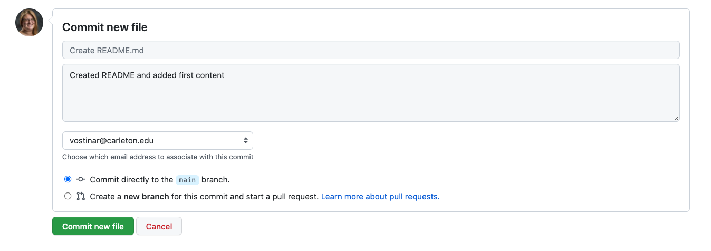

* [Part 1 (Individual)](#part-1-objectives)
* [Part 2 (Team)](#part-2-objectives)

## Part 1 Objectives
* Introduce you to git and GitHub (or re-introduce you if you've used it before).
* Practice the git workflow for using version control on software projects, in your individual repositories
* Practice the git command line interface
* Work with both your local repository (via git) and your personal remote repository (on GitHub).

## Collaboration
You should work individually on this part, but feel free to work simultaneously with nearby classmates for moral support and help.

## Prerequisites
From the [Getting Started Lab](getting-started), you should already have:

* A GitHub account
* A local installation of git on your machine

## Step 1: Accept the assignment
Normally you would make your own new repository at this point, but we're going to use a tool called Git Classroom that let's us keep all of your repositories a bit more organized.

**Accept the assignment by clicking on the link in Moodle**, which will set up a new git repository for you that I also have access to. We'll be using this repository for your individual deliverables during the term. You should now see this (with your username instead):


There is some extra stuff that has to do with a feature for giving feedback that we are going to try out, but don't worry about it right now.

## Step 2: README
You should always have a README file for a repository and GitHub let's you do some editing of files like this right in the browser. Click the "Add a README" button:


If the syntax doesn't look familiar to you, this is *markdown*, which is a quick way of adding rich text-like features to plain text. The "#" indicates a top-level heading; "normal" text is just typed. You can just type normal text and be just fine, but if you're interested in learning more, check out [this resource](https://www.markdownguide.org/basic-syntax/).

There is a lot of opinion out there on what should all be in a README, but at a minimum it should provide an overview of the contents and links to any relevant information such as documentation. You don't actually know what all is going to go into this repo yet, and that's okay. **Add the creation date and a description about how it will contain the individual deliverables for this course.**

**Scroll to the bottom to commit the file to the repository.** (Since this is our remote repository, we don't need to push the file this time.) Make sure you **add a commit message** to the log like I've done. This allows you to go back and read descriptions of what you've committed, rather than trying to deduce this later from the set of files you committed:



So now your repo should look something like:


## Step 3: Make a local version of your repository
For this next set of steps, you will need access to a terminal.

We don't currently have a local version of our repository. To create one, we can clone the remote repository.

First, go to a terminal, and create a directory. This is where your local repository will live. (Use your newly-acquired Unix skills to do so!)

Now we're ready to rock. Go to the GitHub page for the repository that you created. Click on the green "Code" button. You should see something that looks like this: 


**Make sure you see https:// as the first part of the URL**. If you don't, click on "Use HTTPS" in the right hand corner of that box.

Copy the URL (pressing the clipboard icon next to the URL should do the trick). Then, in your terminal, type the following:

```bash
git clone [URL]
```

replacing `[URL]` with the URL that you copied and pasted from GitHub. For instance, I'd do:

`git clone https://github.com/CS-257-S22/individual-deliverables-anyaevostinar.git`

List the contents of your current directory and make sure you see the name of your repo (for instance, I'd see a directory named `individual-deliverables-anyaevostinar`). Change into that directory. You should see `README.md` listed. If so, huzzah! You now have a local version of your repository.

## Step 4: Add files locally
Most of the work you'll do will be in your local repository. In other words, you'll create and edit files on your own computer. You'll then have to add and commit these to your local repository, and then make sure these edits are pushed to the remote repository, so that everything is in sync.

Modern IDEs make it a lot easier to work with git repositories and I highly recommend you use VSCode in this class since it has some additional functionality that will come in handy. **Open VSCode and open your repository folder within VSCode.** One thing nice about VSCode is that it has a built-in Terminal that you can use. To open the Terminal, **drag up from the bottom of your VSCode window or use the "Terminal" option in your menu bar.** Make sure that you are in the correct folder in your Terminal by listing the contents and changing directory if needed.

Let's create a file for our repository, named `favorite_foods.txt`. This is a plain text file, and should list your three favorite foods. Within VSCode, you can make a new file with the "File" menu option or there is a new file shortcut above the list of all the files on the left side.

Satisfied with the list? Make sure you've saved the file in your local repo directory. (Do an `ls` in the terminal to make sure it's there. If you don't see it, go back to the text editor and do a "Save As", making sure you're saving it to the right directory.)

Now let's add it to our local repository. To do this, we need to *stage* the file and then *commit* the file. Staging tells git we intend to make this change to the local repository, and commit follows through with this intention and actually makes the change.

In the terminal (make sure you're still in your repo directory!):

```bash
git add favorite_foods.txt
git commit -m "Some favorite foods"
```

The part `-m "Some favorite foods"` writes the message "Some favorite foods" to the git log, similarly to what we did when we directly edited our `README.md` file on GitHub.

We've changed our local repository; now let's change the remote repository to reflect these changes by pushing our changes "upstream". In the terminal:


```bash
git push
```
Now if you go back to GitHub and refresh the page, you should see the changes you made locally.

You should see something in that middle box that says "4 commits", or something similar:


If you click on what I've circled, you can see a history of what you've committed, including the log messages you typed.

You can also see this history locally by typing in your terminal or repl:

```bash 
    git log
```

## Step 5: Adding and modifying files
Anytime you add a new file OR make a change to an existing file, you need to stage the file using `git add`. If you want to add all of the files that have changed, you can type `git add *` (but I recommend you don't do that most of the time, since you might end up adding things that you didn't mean to add!).

Here are some things to try. After each one, make sure you add, commit, and push your changes as outlined above.

1. Modify your `favorite_foods.txt` file so that it lists a few more foods.
2. Add a text file named `favorite_hobbies.txt` that lists some of your favorite hobbies.
3. Add a text file named `least_favorite_foods.txt` listing a few of your least favorite foods.

## Step 6: Removing files but keeping them in the history
You've decided that you don't want that kind of negativity in your life right now, so you want to remove `least_favorite_foods.txt` so that you don't see it in your repository anymore. However, you do want to maintain its existence in the commit history. How do you do this?

Basically, you "reverse-stage" the file using `git rm`, and then commit and push as usual:

```bash 
git rm least_favorite_foods.txt
git commit -m "removed least favorite foods"
git push
```

You should no longer see it in your repository, although it will still be in the history.

## Step 7: Practicing merge conflicts on your own
One of the most annoying and frustrating aspects of working on a shared codebase is when two people make changes to the same file at the same time, and one commits and pushes before the other. How do you recover from this?

The fancy term for this scenario is a *merge conflict*, and it is quite common. There are some ways we can minimize the odds of a merge conflict occurring:

* Before you start working on your code, and before/after you commit/push changes, make sure you bring your local repository up to date. You can do this via either git checkout or git fetch in your repo directory.
* Try to have different people work on different branches, and merge the changes back in later. (We'll cover that in Part 2 of the lab.)
* Communicate about who's working on what, to avoid duplicating efforts. This is probably the easiest and most overlooked way to avoid merge conflicts!

For this part, you are going to create your own merge conflict, so that you can learn how to resolve merge conflicts when the stakes are low and you don't have to coordinate with other people.

First, I'm going to dutifully update my repository before I start making local changes. In my repo directory (in a terminal):

```bash
    git checkout
 ```

It should tell you that "Your branch is up to date with origin/main" which is a happy moment!

Now, go back to GitHub and click on one of the files in your repository. You're going to edit this on GitHub directly, by clicking on the pencil icon:


Edit, add a commit message, and then commit like we did with the `README.md` file earlier.

Now, go back to your local copy of the repository, and **edit the same file.** Add and commit as you normally do. When you push, however, you'll get an error that looks something like this:

```bash 

! [rejected]        main -> main (fetch first)
    error: failed to push some refs to 'https://github.com/CS-257-S22/individual-deliverables-anyaevostinar.git'
    hint: Updates were rejected because the remote contains work that you do
    hint: not have locally. This is usually caused by another repository pushing
    hint: to the same ref. You may want to first integrate the remote changes
    hint: (e.g., 'git pull ...') before pushing again.
    hint: See the 'Note about fast-forwards' in 'git push --help' for details.

```

Stay calm! Git messages are actually pretty helpful, and it's telling you why your update was rejected. It even gives you a hint of what to do next! To fix this, you will need to first pull:

```bash
git pull
```

And git will try to smoosh the changed files together, but it won't be able to do the merging automatically because it doesn't know which version of the changes you actually want to keep. This is a time when using VSCode is nice because it helps you with "merge conflicts" if you know what it's doing. Open the file that you changed in VSCode and you should see something like this:


Whether you are using VSCode or not, those funky "<<<<<<<<< HEAD" ">>>>>>>>>>>>>>>>" with a long alphanumeric string mean that git isn't sure which of these lines you want in this file. If you aren't using VSCode, you might have to just manually delete one or the other (or just get rid of two weird lines if you want to keep both), but VSCode gives you some nice buttons to speed up this process. You can click "Accept Current Change", "Accept Incoming Change", or "Accept Both Changes" and VSCode will fix the file for you.

Now you just need to save, add, commit, and push and everything will be fixed.

Now try this:

1. Create a merge conflict the same way you just did, i.e. edit the same file both directly on GitHub and locally.
2. Resolve the merge conflict locally like you just did, except this time **delete** the item you added when you edited the file on GitHub. So, in the example above, instead of keeping "underwater basket weaving", delete that from the text file you're editing locally.
3. Add, commit, and push.

## Part 1 is done!
Make sure all of your lab files are committed and pushed to your GitHub repository.

## Part 2 Objectives

* Introduce, or re-introduce, you to git and GitHub.
* Practice the git workflow for using version control on software projects, in your team repositories
* Practice the git command line interface
* Work with both your local repository (via git) and your team's remote repository (on GitHub).

## Collaboration
Work with your project teams on this part of the lab. Make sure you finish Part 1 before attempting this part of the lab.

## Step 1: Make a team repository
You will need to set up your team's project repository before you begin. To do so, do the following:

* Accept the invitation by clicking on the link in Moodle ("Git Team Link")
* Accept the assignment.
* Have **one** member of your team make a repository and invite the other team members to this repository. **Name your repository "X", where you replace "X" with the (capitalized) letter of your team.**

The team member that creates the team repository should update the README file. For now, just list your team members' names in this file. You can edit it directly in GitHub, as we did in Step 2 of Part 1.

## Step 2: Set up your local repository
For the rest of the lab, you will need access to a terminal.

Clone the team's repository in a terminal, as you did with your own repository in Part 1. `cd` into that directory and make sure you see the README file.

## Step 3: Creating your own working branch
In Part 1, I mentioned that one way you could minimize merge conflicts was to have team members work on separate branches of the code. We are going to practice branching in this part of the lab.

A branch can be thought of as a "parallel track" to the main track of the repository. The main is the "official", ready-to-deploy-if-necessary version of the codebase. Branches are works in progress that ideally will be integrated into main at some point. Branches allow you to try out ideas, or work on particular features, until you're satisfied with them.

[This article](https://thenewstack.io/dont-mess-with-the-master-working-with-branches-in-git-and-github/) is a nice, easy to follow introduction to branches and branching, and a lot of what we'll be doing in this part of the lab is similar to what you'll find in that article.

First, create a branch locally. In your terminal:

```bash
git checkout -b my-branch-NAME
```

Replace NAME with your first name (no spaces or special characters). This command creates the branch, and then performs a checkout, which creates a "snapshot" of the codebase at that moment within your branch.

(If you want to check out a branch that's already been created, do `git checkout BRANCH_NAME`)

Since we'll eventually merge everyone's branches back into main, this next part will require a bit of coordination on the part of team members. Each person's branch should contain two text files: one containing a list of each team member's favorite ____, and one containing a list of each team member's least favorite ____. (This part will thus require you to communicate with your team, and will teach you a bit about your team members.)

The topics you can choose from, although feel free to substitute your own:

* Movies
* Foods
* Animals
* Hobbies
* Hot beverages
* Cold beverages
* Books

This is easier with an example, so I'm going to use the mythical Team Q to illustrate.

* Team Q decides to go with "movies", "foods", "animals", and "hot beverages".
* Team Q assigns one topic to each team member:
    * Radia is assigned "movies"
    * Manuel is assigned "foods"
    * Timnit is assigned "animals"
    * Joy is assigned "hot beverages"

* Let's follow Radia as she works on her branch:
    * Radia creates a branch named `my-branch-radia`
    * Radia creates two text files: `favorite_animals.txt` and `least_favorite_animals.txt`
    * Radia asks everyone to let her know what their favorite and least favorite animals are.
    * A fight breaks out between the cat people and the dog people....
    * ...but Radia ignores the fight that's brewing, and adds everyone's favorite animal (along with their name) to the `favorite_animals.txt` file, and everyone's least favorite animal (along with their name) to `least_favorite_animals.txt`.
* Everyone else on Team Q does the same with their topics, on their own branches.

Once you've added the appropriate information to the appropriate text files, commit and push your branch upstream. To do so:

```bash
git add *
git commit -m "favorites from my teammates"
git push -u origin BRANCH
```

Replace BRANCH with your branch name.

Now, if you go to GitHub, you should be able to see your branch (and your teammates' branches too, if they've already pushed their branches). Go to the circled drop-down menu: 


When you click on it, you should see this drop-down:


Select your branch (or one of your teammate's branches), and you'll see the snapshot of that branch displayed.

## Step 4: Merging your branch back into main
Once you're satisfied with your changes, and your teammates agree, it's a good idea to merge your branch back into the main track, and delete the branch.

```bash 
git checkout main
git pull
git merge BRANCH -m "merging my branch into main"
git push
```

(Replace BRANCH with your branch name.)

Now go back to GitHub and switch back to viewing main. You should see your branch's files.

If you want to delete your branch, go ahead and do so:

```bash 
git branch -d BRANCH
```

(Replace BRANCH with your branch name.)

## Step 5: Practicing merge conflicts with your team
For this part of the lab, split into pairs. The first pair (A and B) will create a merge conflict and then resolve it, while the other pair (C and D) also creates a merge conflict and resolves it with different files.

To create the merge conflict:

1. Make sure you all have the latest snapshot of the main branch locally:
    ```bash 
    git checkout main
    git pull
    ```
2. A and B should agree on which file they'll edit simultaneously, in your local repository. C and D should agree on a different file that they'll edit simultaneously as well.
3. Everyone should edit and commit the file that they are working with locally.
4. **A and C** should push changes to the repo first.
5. Once they have successfully pushed their changes, B and D should try to push their changes. Bingo: merge conflict achieved! (Though note that the changes from the other pair aren't an issue!)
6. Repeat the steps from Part 1 to resolve the conflict.

## Part 2 is done!
You don't have to do anything else --- just make sure you have all the lab files you created in your team's repository.

**If there is still time in class, keep working on your dataset and team contract!**

*This lab was adapted from one written by Prof. Amy Csizmar Dalal, thanks Amy!*